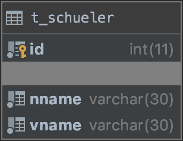

# Erweiterung 1 (Seite 22-24)

### Aufgabe 9:

Was passiert, wenn Sie dennoch versuchen, in der Klasse SchuelerTest ein Entitätsob- jekt der Klasse Schueler ohne Angabe von vorname oder nachname zu persistieren?

    -> PropertyValueException
    
    
### Aufgabe 10:

Geben Sie die Tabellenstruktur der Tabelle t_schueler an:

### Aufgabe 11:

Welche Tabelle(n) befinden sich neben der t_schueler noch (immer) in der Datenbank?

    -> hibernate_sequence

### Aufgabe 12:

Warum sind diese Tabelle(n) (noch immer) in der Datenbank?

    -> hibernate_sequence ist eine Hilfstabelle für das DBMS um den auto increment Primary Key
     in der t_schueler Tabelle für neue Objekte richtig zu generieren 
     
# Erweiterung 2 (Seite 39-46)

